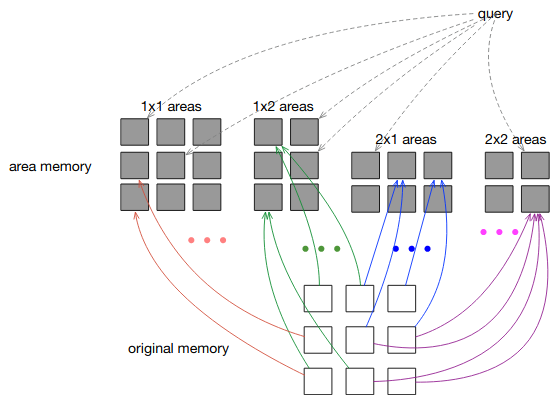

# Area Attention
PyTorch implementation of Area Attention [1].
This module allows to attend to areas of the memory, where each area contains a group of items that are either spatially or temporally adjacent.
TensorFlow implementation can be found [here](https://github.com/tensorflow/tensor2tensor/blob/master/tensor2tensor/layers/area_attention.py).

## Setup
```bash
$ pip install area_attention
```

## Usage
```python
import torch

from area_attention import AreaAttention

q = torch.rand(4, 8, 32)
k = torch.rand(4, 16, 32)
v = torch.rand(4, 16, 64)
area_attention = AreaAttention(
    key_query_size=32,
    area_key_mode='max',
    area_value_mode='mean',
    max_area_height=2,
    max_area_width=2,
    memory_height=4,
    memory_width=4,
    dropout_rate=0.2,
    top_k_areas=0
)
x = area_attention(q, k, v)
x  # torch.Tensor with shape (8, 64)
```

## Unit tests
```bash
$ python -m pytest tests
```

## Bibliography
[1] Li, Yang, et al. "Area attention." International Conference on Machine Learning. PMLR, 2019.

## Citations
```bibtex
@inproceedings{li2019area,
  title={Area attention},
  author={Li, Yang and Kaiser, Lukasz and Bengio, Samy and Si, Si},
  booktitle={International Conference on Machine Learning},
  pages={3846--3855},
  year={2019},
  organization={PMLR}
}
```
